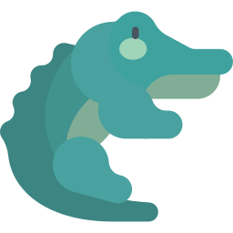
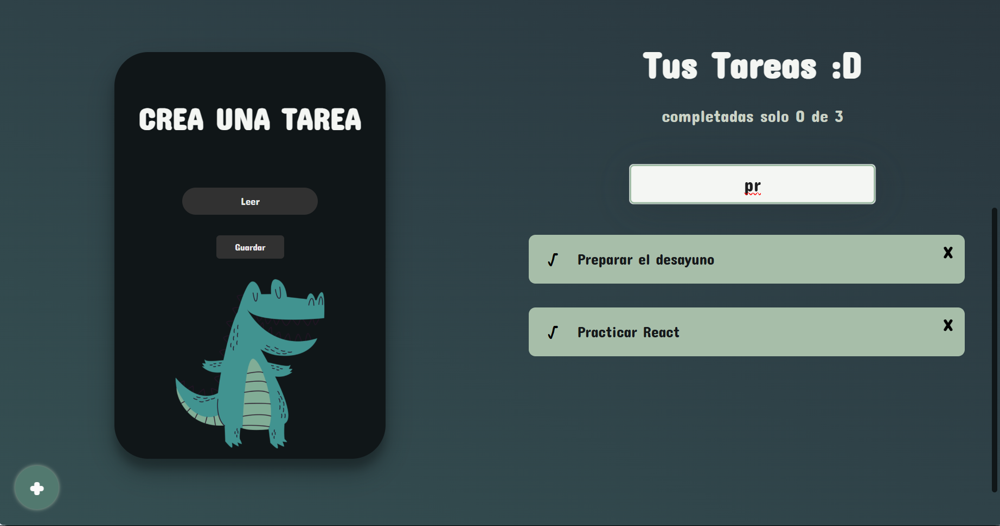

# TO DO DRILO



  


Hello, this was a project to put into practice knowledge in **React**, understanding the basic concepts of this framework, getting a To-Do-List but with a style of its own and aimed for children. 
I thought in the future create your app for tablets and children order their homework, thanks for reading.

---

## ✨ Features

- Task list
- Delete tasks
- Mark tasks already done
- Search tasks

---

## 📸 Screenshots

**Example of use**  
You can see what the web program looks like visually:


Search results of any task, the filter is by the initial word:



---

## ⚙️ Installation

Clone this repository and run the app locally with just a few commands:

```bash
git clone https://github.com/Luis3Fernando/To-Do-Drilo
```
```bash
cd To-Do-Drilo
```
```bash
npm install
```

```bash
npm run dev
```
you can analyze the project and get inspired to create one in your own style, or use the following link for your daily use: https://luis3fernando.github.io/To-Do-Drilo/
